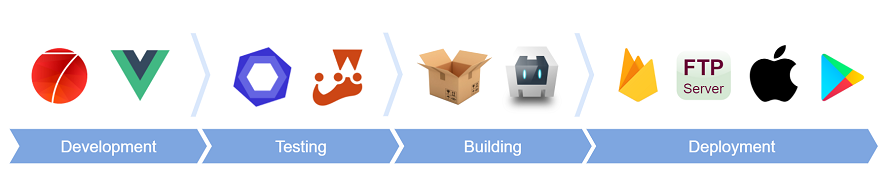

# App Framework 2 &nbsp; &nbsp; &nbsp;   

**iOS and Android Apps with HTML & JavaScript - App Framework combines great pieces of open source code to support your whole workflow with useful scripts and your app with powerful plugins. With App Framework, you could spend your time for your next amazing App and not for the tricky stuff around - free and open source!**

 

---

## Version 2 under development

> Completely rewritten with new best practice - to support what's coming next - Framework7 2!

> :warning: &nbsp; Please switch to the [master tree](https://github.com/scriptPilot/app-framework/tree/master) for productive usage!

---

 
 

### Quick start for developers

1. `git clone https://github.com/scriptPilot/app-framework.git --branch v2` to clone the repo 
2. `cd app-framework` to open the folder
3. `npm install` to install all dependencies
4. `npm run update` to create all configuration files
5. `npm run dev` to start the development server
