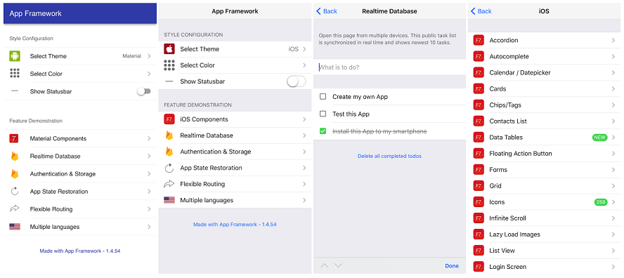

# App Framework 2 &nbsp; &nbsp; &nbsp;   

**iOS and Android Apps with HTML & JavaScript - App Framework combines great pieces of open source code to support your whole workflow with useful scripts and your app with powerful plugins. With App Framework, you could spend your time for your next amazing App and not for the tricky stuff around - free and open source!**

## Features

- [ ] ...
- [ ] ...
- [ ] ...

## Documentation

**Quick Start** for the hurried

1. Run `mkdir my-app` to create a new project folder
2. Run `cd my-app` to open the project folder
3. Run `echo {} > package.json` to create the package.json file
4. Run `npm install --save-dev app-framework` for installation
5. Run `npm run dev` to start the local development server

**Tutorial** for the beginners

- ...
- ...
- ...

**Reference** for the experts

- [Architecture](docs/reference/architecture.md)
- [CLI Commands](docs/reference/cliCommands.md)
- ...

**Guidelines** for the contributors

- ...
- ...
- ...

## Demo App

&nbsp;&nbsp;&nbsp;

&nbsp;&nbsp;&nbsp;

