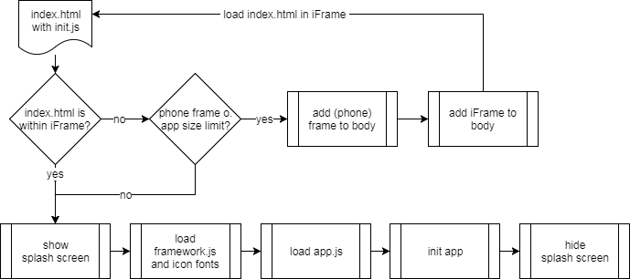

# Architecture

> This document is part of the [App Framework Documentation](../../README_V2.md#documentation)

<br />

## Coding Rules

- [x] All code must be compliant with the [Airbnb JavaScript Style Guide](https://github.com/airbnb/javascript)
- [x] All JavaScript files must start with `// Purpose: ...`

## Documentation Rules

Content

- [x] All relevant facts must be part of the documentation
- [x] Documentation must be kept short, descriptive and easy to understand
- [x] Documentation must contain examples

Typography

- [x] Documentation headlines must be written in [Title Case](http://www.grammar-monster.com/lessons/capital_letters_title_case.htm)
- [x] All folder or file names must be indicated like **this**
- [x] All required user input must be indicated like `this`
- [x] All returned values must be indicated like *this*

## Scripts

- [ ] All scripts must be called with Babel Node to support import/export statements
- [ ] All scripts must be saved into sub folders (Example: `test:eslint` to **scripts/test/eslint.js**)
- [ ] File **scripts/common.js** provides obligatory [functions and values](commonFunctions.md)
- [ ] File **scripts/config.json** contains the obligatory script configuration

## Client Code

- [ ] The client code is bundled with Webpack on any dev or build command

Folder Structure

```
client/
├── mixins/            # Global mixins
├── app.js             # Loads the app component, the pages, init. the app and removes the splash screen
├── framework.js       # Loads Framework7/Vue, icon fonts, mixins and attaches the Vue to the window object
├── index.html         # Provides the initial HTML template and the init chunk
├── init.js            # Provides the splash screen, preloading functionality and phone frame handling
└── webpackConfig.js   # Provides the Webpack config for development and production
```

Loading Sequence

<br />



## Demo App

- [ ] The Demo App covers all App Framework functions, provided by the mixins
- [ ] The Demo App includes the Framework7-Vue kitchen sink for demonstration purposes
